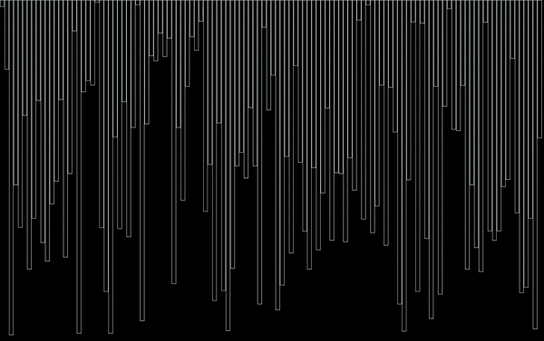
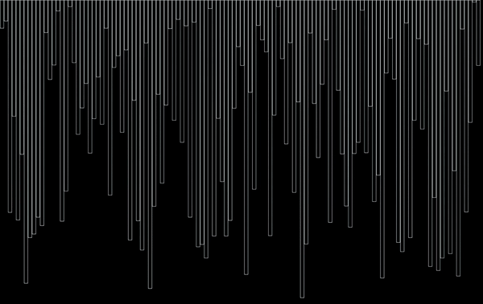

# Sorting Algorithm Visualizer
### Griffin MacNaughtan - 2022
---

Welcome to my sorting algorithm visualizer! I made this to get a better understanding of how popular sorting algorithms work both visually and programatically. See below for instructions and explanations!

To use this visualizer, the easiest way is to run the .exe file, but if you want to compile and run the cpp file yourself, you need to download SDL to your machine by following the instructions [here](http://lazyfoo.net/tutorials/SDL/01_hello_SDL/index.php "SDL Download Instructions")

The controls are given before running, but I'll add them here too (They are all simple key presses):
* ESC to exit program
* Space bar to randomize list of items
* 1 for a faster sort speed
* 2 for a slower sort speed
* 0 for bogo sort (warning, unlikely to successfully sort, as the worst case time complexity is O(infinity). LOL)
* b for bubble sort
* h for heap sort
* i for insertion sort
* m for merge sort
* q for quick sort
* s for selection sort
* More coming soon!

Attached are two gifs of the program in motion, and see below for references and methodologies.

Quick Sort

Insertion Sort

References and Methodologies coming soon!

